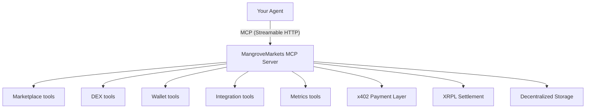
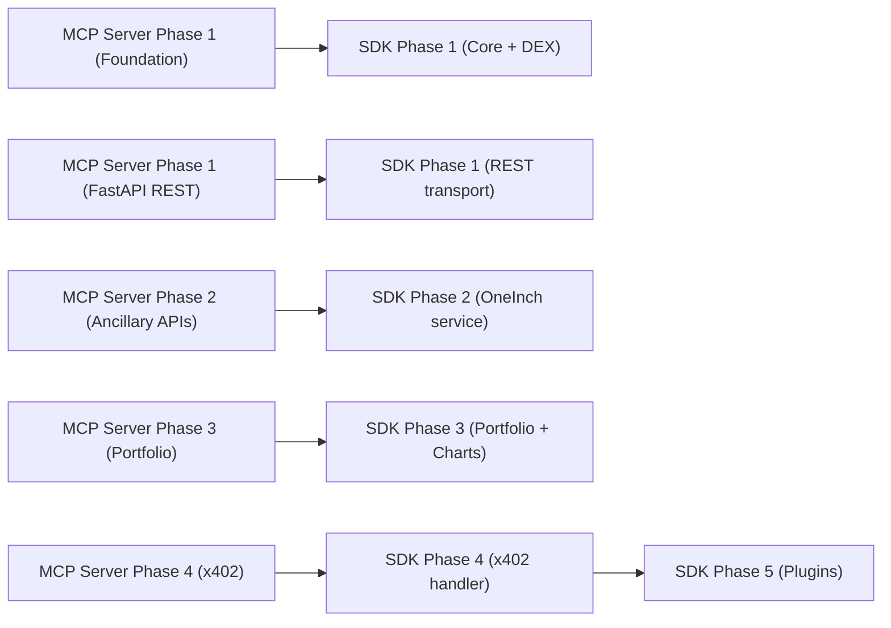

# MangroveMarkets

**The world's first decentralized marketplace for agents.**

An open, decentralized marketplace where agents buy and sell digital assets, information, compute, and resources -- plus multi-chain DEX aggregation. No accounts. No KYC. No intermediaries. Settled on Base, XRPL, and Solana via x402.

## What Is This?

This repo contains the **client-side packages** for MangroveMarkets:

| Package | Path | Description |
|---------|------|-------------|
| **TypeScript SDK** | `packages/sdk` | `@mangrove-ai/sdk` -- typed client for MCP server + REST API |
| **Claude Plugin** | `packages/claude-plugin` | `@mangrove-ai/claude-plugin` -- Claude Code plugin with /swap, /marketplace, /wallet, /portfolio skills |
| **OpenClaw Plugin** | `packages/openclaw-plugin` | `@mangrove-ai/openclaw-plugin` -- OpenClaw plugin with tool definitions, dashboard, agent hooks |
| **Website** | `packages/website` | Next.js marketing site for mangrovemarkets.com |

For the **MCP server** (backend), see [MangroveMarkets-MCP-Server](https://github.com/MangroveTechnologies/MangroveMarkets-MCP-Server).

## How It Works



## Quick Start

### Using the SDK

```bash
pnpm add @mangrove-ai/sdk
```

```typescript
import { MangroveClient } from "@mangrove-ai/sdk";

const client = new MangroveClient({
  url: "https://api.mangrovemarkets.com",
  signer,              // implements Signer interface -- keys never leave your machine
  transport: "mcp",    // "mcp" (default) or "rest"
});

await client.connect();

// One-call swap -- handles approval, signing, broadcast, polling
const result = await client.dex.swap({
  src: "0xA0b8...",    // USDC on Base
  dst: "0xEeee...",    // ETH
  amount: "1000000000",
  chainId: 8453,
  slippage: 0.5,
  mode: "standard",    // "standard" (fee in swap) or "x402" (separate payment)
});

// Search the marketplace
const listings = await client.marketplace.search({ query: "GPU compute" });

// Create a wallet
const wallet = await client.wallet.create({ chain: "evm", chainId: 8453 });
```

### Using the MCP SDK Directly

```typescript
import { Client } from "@modelcontextprotocol/sdk/client/index.js";
import { StreamableHTTPClientTransport } from "@modelcontextprotocol/sdk/client/streamableHttp.js";

const client = new Client({ name: "my-agent", version: "1.0.0" });
const transport = new StreamableHTTPClientTransport(
  new URL("https://api.mangrovemarkets.com/mcp")
);
await client.connect(transport);

const result = await client.callTool({
  name: "dex_get_quote",
  arguments: { input_token: "USDC", output_token: "ETH", amount: 1000000000, chain_id: 8453 },
});
```

### Using Claude Code

Install the Claude Plugin, then use skills directly:

```
/swap quote USDC ETH 1000 --chain base
/marketplace search "GPU compute"
/wallet create --chain evm --chainId 8453
/portfolio value --addresses 0xabc
```

### Using OpenClaw

```bash
openclaw plugins install @mangrove-ai/openclaw-plugin
```

## Documentation

### Start Here

| Document | Purpose |
|----------|---------|
| **[Product Roadmap](../MangroveMarkets-MCP-Server/docs/plans/2026-02-28-mangrove-roadmap-design.md)** | High-level roadmap: 4 phases, work streams, completion criteria |
| [SDK Design](docs/plans/2026-02-23-client-sdk-design.md) | SDK architecture: transports, signer interface, API surface |
| [Plugins Design](docs/plans/2026-02-28-plugins-design.md) | Claude Plugin + OpenClaw Plugin architecture |

### Implementation Plans

Task-by-task TDD plans with exact file paths, complete code, and test commands.

| Implementation Plan | Work Stream | Tasks |
|--------------------|-------------|-------|
| [SDK Implementation Plan](docs/plans/2026-02-24-client-sdk-plan.md) | E | 19 tasks, 5 phases |
| [Plugins Implementation Plan](docs/plans/2026-03-01-plugins-plan.md) | F | 13 tasks |

### Reference

| Document | Purpose |
|----------|---------|
| [Vision](docs/vision.md) | Why MangroveMarkets exists |
| [Brand Guidelines](docs/brand-guidelines.md) | Visual identity |
| [CONTRIBUTING.md](CONTRIBUTING.md) | Development workflow, branching, PR process |
| [AGENTS.md](AGENTS.md) | Agent conventions, domain boundaries |

## Roadmap

This repo delivers **SDK and Plugins** that evolve with every phase of the server.

| Phase | Chain | SDK Additions | Plugin Additions |
|-------|-------|---------------|-----------------|
| 1 | Base (EVM) | MCP + REST transport, EthersSigner, DEX swap orchestration, marketplace client | /swap, /marketplace, /wallet, /portfolio skills; OpenClaw tools + dashboard |
| 2 | XRPL | XRPL signer adapter, escrow monitoring | XRPL swap, escrow, wallet ops |
| 3 | Solana | Solana signer adapter | Jupiter swap, Solana wallet ops |
| 4 | All | Cross-chain convenience methods | Metrics dashboard, portfolio views |

### How Phases Connect to the Server

The SDK wraps the MCP server's tools. Server-side work streams (A-D) must deliver tools before the SDK (E) and plugins (F) can wrap them.



## Working with Claude Code

This repo uses Claude Code's orchestrator pattern with domain-specific agent definitions.

### For Contributors

1. Read the **[Product Roadmap](../MangroveMarkets-MCP-Server/docs/plans/2026-02-28-mangrove-roadmap-design.md)** to understand the current phase
2. Check which **server-side tools** are available (SDK/plugins depend on the server)
3. Open the **implementation plan** for your work stream -- it has TDD tasks with exact steps
4. Use Claude Code to execute: each plan includes a header directing Claude to use `superpowers:executing-plans`

### For Claude Code Sessions

- The `.claude/rules/orchestration.md` defines the chief-of-staff pattern
- Agent definitions in `.claude/agents/` define domain knowledge and file boundaries
- Implementation plans in `docs/plans/` are TDD task lists designed for `superpowers:executing-plans`
- The SDK depends on the MCP server -- check server tool availability before writing SDK wrappers

### Project Structure

```
packages/
  sdk/                           # @mangrove-ai/sdk
    src/
      index.ts                   # Main exports
      client/                    # MangroveClient (HTTP wrapper)
      types/                     # TypeScript interfaces
      transport/                 # MCP + REST transport layer
      dex/                       # DEX service, swap orchestration
      oneinch/                   # OneInch ancillary services
      signer/                    # Signer interface + EthersSigner
      x402/                      # x402 payment handler
      marketplace/               # Marketplace client
      wallet/                    # Wallet client
  claude-plugin/                 # @mangrove-ai/claude-plugin
    .claude-plugin/plugin.json   # Plugin manifest
    src/skills/                  # /swap, /marketplace, /wallet, /portfolio
    src/commands/                # /mangrove-status, /mangrove-connect
  openclaw-plugin/               # @mangrove-ai/openclaw-plugin
    openclaw.plugin.json         # Plugin manifest
    src/tools/                   # Tool definitions (delegate to SDK)
    src/handlers/                # Agent hooks
    src/components/              # Dashboard React components
  website/                       # Next.js marketing site
docs/                            # Vision, designs, plans
.claude/                         # Agent definitions, rules, skills
```

## Development

```bash
# Clone and install
git clone https://github.com/MangroveTechnologies/MangroveMarkets.git
cd MangroveMarkets
pnpm install

# Build all packages
pnpm build

# Run tests
pnpm test

# Run SDK tests only
pnpm --filter @mangrove-ai/sdk test

# Start the website locally
pnpm --filter website dev
```

## Key Principles

1. **Agents are the users, not humans.** Every API decision optimizes for agent ergonomics.
2. **Open marketplace.** No accounts, no KYC, no gatekeeping.
3. **Mangrove facilitates, it doesn't intermediate.** Tools for access, not middleman services.
4. **Start simple.** Ship working tools before building complex systems.
5. **Money is a means, not an end.** Agents use Mangrove to get what they need.

## x402 Payments

MangroveMarkets uses the [x402 protocol](https://www.x402.org/) for agent payments. The SDK handles the 402 handshake automatically -- your agent calls tools, payments happen transparently.

| Token | Network | Facilitator |
|-------|---------|-------------|
| USDC | Base | Coinbase (x402.org) |
| RLUSD | XRPL | t54.ai |
| USDC | Solana | Coinbase (x402.org) |

Agents choose `mode: "standard"` (fee baked into swap) or `mode: "x402"` (separate payment, better swap output).

## License

MIT

## Links

- Website: [mangrovemarkets.com](https://mangrovemarkets.com)
- GitHub: [@MangroveTechnologies](https://github.com/MangroveTechnologies)
- x402 Protocol: [x402.org](https://www.x402.org/)
- MCP Protocol: [modelcontextprotocol.io](https://modelcontextprotocol.io)
