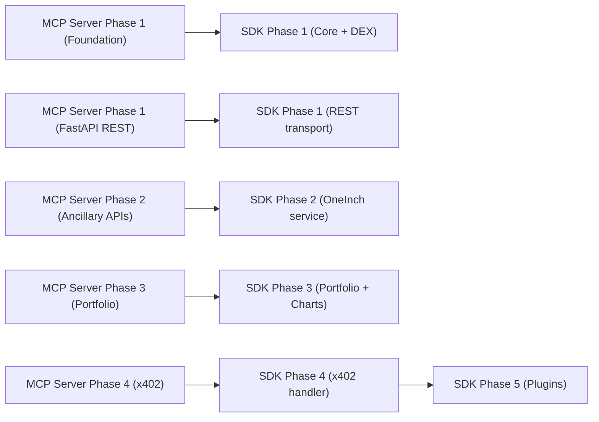

# MangroveMarkets Client SDK Design

**Date:** 2026-02-23
**Status:** Approved
**Approach:** B — Domain-Scoped SDK with Signing Orchestration
**Package:** `@mangrove-one/mangrovemarkets` (npm, public)

---

## Goal

Build a TypeScript SDK that wraps the MangroveMarkets MCP server's DEX and 1inch tools, providing both high-level orchestrated swap execution and low-level step-by-step control. Agents sign transactions locally — private keys never leave the client.

## Core Principles

- **Agent signs locally** — pluggable Signer interface, key never exposed to SDK or server
- **Two API levels** — `client.dex.swap()` for one-call execution, individual methods for full control
- **Two transports** — MCP (primary) + REST fallback (requires FastAPI on server)
- **Dual audience** — works for AI agents and for developers building agent applications

## Security Model

- SDK defines a `Signer` interface — a black box that signs transactions
- SDK passes unsigned calldata TO the Signer, gets signed bytes BACK
- The SDK itself never sees or stores private keys
- Built-in `EthersSigner` adapter (ethers.js as optional peer dependency) for convenience
- Consumers can implement their own Signer (MPC wallet, hardware wallet, wallet MCP server, etc.)

## Monorepo Structure

```
MangroveMarkets/
├── packages/
│   ├── sdk/                          # @mangrove-one/mangrovemarkets
│   │   ├── src/
│   │   │   ├── index.ts              # Main exports
│   │   │   ├── client.ts             # MangroveClient class
│   │   │   ├── transport/
│   │   │   │   ├── interface.ts      # Transport interface
│   │   │   │   ├── mcp.ts            # MCP SDK transport (primary)
│   │   │   │   └── rest.ts           # REST fallback transport
│   │   │   ├── dex/
│   │   │   │   ├── index.ts          # DexService class
│   │   │   │   ├── types.ts          # Quote, UnsignedTransaction, etc.
│   │   │   │   └── swap.ts           # High-level swap orchestration
│   │   │   ├── oneinch/
│   │   │   │   ├── index.ts          # OneInchService class
│   │   │   │   └── types.ts          # Balance, Portfolio, etc.
│   │   │   ├── signer/
│   │   │   │   ├── interface.ts      # Signer interface definition
│   │   │   │   └── ethers.ts         # Optional ethers.js adapter
│   │   │   └── x402/
│   │   │       └── handler.ts        # x402 payment handshake (future)
│   │   ├── package.json
│   │   ├── tsconfig.json
│   │   └── vitest.config.ts
│   ├── openclaw-plugin/              # Placeholder
│   │   ├── package.json
│   │   └── README.md
│   ├── claude-plugin/                # Placeholder
│   │   ├── package.json
│   │   └── README.md
│   └── website/                      # Placeholder
│       ├── package.json
│       └── README.md
├── pnpm-workspace.yaml
├── package.json                      # Root workspace config
├── tsconfig.base.json                # Shared TS config
└── .gitignore
```

## SDK API Surface

### MangroveClient

```typescript
const client = new MangroveClient({
  url: "https://api.mangrovemarkets.com",
  signer,                    // implements Signer interface
  transport: "mcp",          // "mcp" (default) | "rest"
});

await client.connect();
// ... use client.dex.* and client.oneinch.*
await client.disconnect();
```

### High-Level DEX API

```typescript
// One-call swap — handles approval check, approve, prepare, sign, broadcast, poll
const result = await client.dex.swap({
  src: "0xA0b86991c6218b36c1d19D4a2e9Eb0cE3606eB48",
  dst: "0xEeeeeEeeeEeEeeEeEeEeeEEEeeeeEeeeeeeeEEeE",
  amount: "1000000000",
  chainId: 8453,
  slippage: 0.5,
  mevProtection: true,
  mode: "standard",        // "standard" (fee in swap) | "x402"
});
// result: { txHash, chainId, status, gasUsed, inputToken, outputToken, inputAmount, outputAmount }
```

### Low-Level DEX API

```typescript
const quote = await client.dex.getQuote({ src, dst, amount, chainId, mode });
const approvalTx = await client.dex.approveToken({ token, chainId });
const signedApproval = await signer.signTransaction(approvalTx);
await client.dex.broadcast({ chainId, signedTx: signedApproval });
const swapTx = await client.dex.prepareSwap({ quoteId: quote.quoteId, slippage: 0.5 });
const signedSwap = await signer.signTransaction(swapTx);
const { txHash } = await client.dex.broadcast({ chainId, signedTx: signedSwap, mevProtection: true });
const status = await client.dex.swapStatus({ txHash, chainId });
```

### OneInch Ancillary APIs

```typescript
// Balance & Portfolio
const balances = await client.oneinch.getBalances({ chainId, wallet });
const allowances = await client.oneinch.getAllowances({ chainId, wallet, spender });
const portfolio = await client.oneinch.getPortfolioValue({ addresses, chainId });
const pnl = await client.oneinch.getPortfolioPnl({ addresses, chainId });
const tokens = await client.oneinch.getPortfolioTokens({ addresses, chainId });
const defi = await client.oneinch.getPortfolioDefi({ addresses, chainId });

// Pricing & Market Data
const price = await client.oneinch.getSpotPrice({ chainId, tokens });
const gas = await client.oneinch.getGasPrice({ chainId });
const chart = await client.oneinch.getChart({ chainId, token0, token1, period });

// Token Discovery
const results = await client.oneinch.searchTokens({ chainId, query: "USDC" });
const info = await client.oneinch.getTokenInfo({ chainId, address });

// History
const history = await client.oneinch.getHistory({ address });
```

## Signer Interface

```typescript
interface Signer {
  getAddress(): Promise<string>;
  signTransaction(tx: UnsignedTransaction): Promise<string>;
  getSupportedChainIds(): Promise<number[]>;
}
```

Built-in `EthersSigner` adapter uses ethers.js `Wallet` internally. ethers.js is an optional peer dependency — only required if using `EthersSigner`.

## Transport Layer

```typescript
interface Transport {
  callTool(name: string, params: Record<string, unknown>): Promise<unknown>;
  connect(): Promise<void>;
  disconnect(): Promise<void>;
}
```

- **McpTransport** — uses `@modelcontextprotocol/sdk` with Streamable HTTP(S)
- **RestTransport** — uses `fetch()` to call FastAPI endpoints

### Server-Side Dependency: FastAPI REST API

The REST transport requires the MCP server to expose a parallel REST interface:
- FastAPI routes mapping `/api/tools/{name}` to the same service layer
- Auto-generated Swagger docs at `/api/docs`
- Same Bearer token auth
- Built alongside MCP Server Phase 1

## Types

### DEX Types
- `Quote` — quoteId, venueId, inputToken, outputToken, amounts, fees, chainId, billingMode, routes
- `UnsignedTransaction` — chainId, to, data, value, gas, gasPrice/maxFeePerGas/maxPriorityFeePerGas
- `BroadcastResult` — txHash, chainId, broadcastMethod
- `TransactionStatus` — txHash, chainId, status, blockNumber, gasUsed
- `SwapResult` — txHash, chainId, status, gasUsed, inputToken, outputToken, amounts

### OneInch Types
- `TokenBalance` — tokenAddress, balance
- `SpotPrice` — tokenAddress, priceUsd
- `GasPrice` — fast, medium, slow
- `PortfolioValue` — totalValueUsd, chains
- `OhlcvCandle` — timestamp, open, high, low, close, volume

## High-Level Swap Orchestration

`client.dex.swap()` handles the full multi-step flow:

1. Call `dex_get_quote`
2. Check allowance via `oneinch_allowances`
3. If insufficient: `dex_approve_token` → signer signs → `dex_broadcast` → poll confirmation
4. `dex_prepare_swap` → signer signs → `dex_broadcast`
5. Poll `dex_swap_status` until confirmed/failed
6. Return `SwapResult`

Skips approval for native tokens (ETH). Supports MEV protection opt-in.

## Phasing

**Phase 1: Core + DEX**
- Monorepo scaffold (pnpm workspace, tsconfig, vitest, placeholder packages)
- Transport layer (MCP + REST interfaces, MCP implementation)
- Signer interface + EthersSigner adapter
- `client.dex.*` — getQuote, prepareSwap, approveToken, broadcast, swapStatus
- `client.dex.swap()` — high-level orchestrated swap
- Tests with mocked transport
- Publish `@mangrove-one/mangrovemarkets@0.1.0`

**Phase 2: OneInch Service**
- `client.oneinch.*` — balances, allowances, spotPrice, gasPrice, tokenSearch, tokenInfo
- Tests

**Phase 3: Portfolio + Charts**
- `client.oneinch.*` — portfolioValue, portfolioPnl, portfolioTokens, portfolioDefi, chart, history
- Tests

**Phase 4: x402 Payment Handler**
- `src/x402/handler.ts` — 402 detection, payment signing, retry
- Integrates into `swap()` for x402 billing mode

**Phase 5: Plugins**
- `@mangrove-one/openclaw-plugin`
- `@mangrove-one/claude-plugin`

### Build Order Dependencies



## Out of Scope: Advanced Agent Mode (Future — Approach C)

Documented here for future reference. When ready, add an `src/agent/` module with:

- **Auto-retry with slippage adjustment** — if swap fails due to slippage, retry with progressively higher tolerance (0.5% → 1% → 2%)
- **Gas-aware execution** — check gas prices before swapping, queue execution for lower gas if not time-sensitive; configurable gas strategy (fast/medium/slow/custom)
- **Portfolio-aware routing** — check balances across all chains, suggest cheapest path (e.g., swap on Arbitrum instead of Ethereum to save gas)
- **Multi-swap batching** — rebalance a portfolio in one call: quote multiple swaps, determine optimal execution order, execute sequentially
- **Stop-loss / take-profit** — monitor spot prices via polling, execute swap when price crosses a threshold; `client.agent.watchPrice({ token, chainId, above: 2000, then: swapConfig })`
- **Event-driven hooks** — `onSwapConfirmed`, `onApprovalNeeded`, `onGasSpike`, `onPriceAlert` callbacks for agent frameworks that want event-driven architecture
- **Execution strategies** — TWAP (time-weighted), VWAP (volume-weighted), iceberg orders for large swaps that should be split across time

API surface would be:
```typescript
await client.agent.rebalance({ portfolio, targetAllocations });
await client.agent.watchPrice({ token, chainId, trigger, action });
await client.agent.scheduledSwap({ params, executeAt, gasStrategy });
```

Reference docs:
- MCP server 1inch design: `MangroveMarkets-MCP-Server/docs/plans/2026-02-23-1inch-integration-design.md`
- Full 1inch API surface: `MangroveMarkets-MCP-Server/docs/1inch-convo-hist.md`
- MangroveKnowledgeBase signals: 96 signals, 40+ indicators that could feed agent decisions
