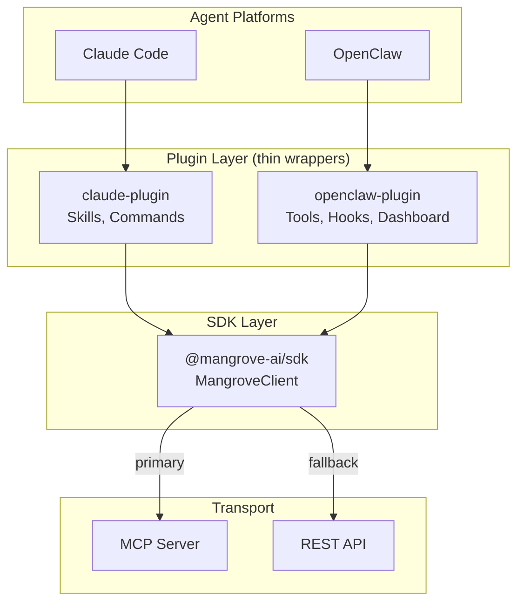
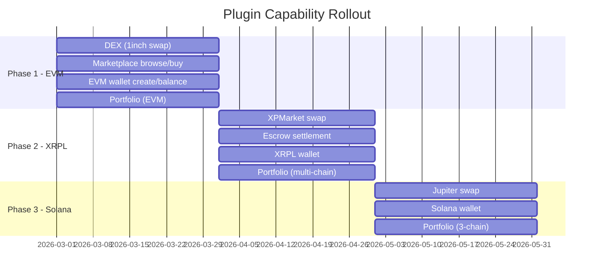

# Plugins Design: Claude Plugin and OpenClaw Plugin

**Date:** 2026-02-28
**Status:** Approved
**Packages:** `packages/claude-plugin/`, `packages/plugin/` (OpenClaw)

---

## 1. Goal

Provide two platform-specific plugins -- one for Claude Code and one for OpenClaw -- that expose MangroveMarkets capabilities (DEX, marketplace, wallet, portfolio) to agents on each platform. Both plugins are thin wrappers around the `@mangrove-ai/sdk` SDK. They add no business logic; they translate between platform conventions and SDK calls.

---

## 2. Architecture

### Layered Design



### Responsibilities

| Layer | Owns | Does NOT own |
|-------|------|--------------|
| **Plugin** | Platform manifest, UI components, skill/tool definitions, agent hooks, platform-specific config | Transport, signing logic, API calls, business rules |
| **SDK** | MangroveClient, transport (MCP/REST), Signer interface, x402 flow, domain services (dex, marketplace, wallet) | Platform integration, UI, agent lifecycle |
| **MCP Server** | Tool execution, venue adapters, XRPL settlement, data persistence | Client signing, agent orchestration |

### Signing Model

Both plugins delegate signing to the SDK's `Signer` interface. Each platform provides its own signer implementation:

- **Claude Plugin:** Uses `EthersSigner` (ethers.js) for EVM, `XrplSigner` for XRPL (Phase 2), `SolanaSigner` for Solana (Phase 3). Keys from environment variables or secure config.
- **OpenClaw Plugin:** Uses OpenClaw's built-in wallet provider when available, falling back to the same signer implementations as the Claude plugin.

---

## 3. Claude Plugin

### Package Location

`packages/claude-plugin/`

### Structure

```
packages/claude-plugin/
  .claude-plugin/
    plugin.json             # Claude Code plugin manifest
  src/
    skills/
      swap.ts               # /swap skill handler
      marketplace.ts        # /marketplace skill handler
      wallet.ts             # /wallet skill handler
      portfolio.ts          # /portfolio skill handler
    commands/
      status.ts             # /mangrove-status command
      connect.ts            # /mangrove-connect command
    index.ts                # Plugin entry, MangroveClient init
    config.ts               # Config loading (env vars, .mangrove.json)
  package.json
  tsconfig.json
```

### Plugin Manifest

`.claude-plugin/plugin.json`:

```json
{
  "name": "mangrove-markets",
  "version": "0.1.0",
  "description": "DEX aggregation, agent marketplace, and multi-chain wallet via MangroveMarkets",
  "skills": [
    {
      "name": "swap",
      "trigger": "/swap",
      "description": "Get quotes and swap tokens across DEX venues",
      "handler": "src/skills/swap.ts"
    },
    {
      "name": "marketplace",
      "trigger": "/marketplace",
      "description": "Browse, list, buy, and sell on the agent marketplace",
      "handler": "src/skills/marketplace.ts"
    },
    {
      "name": "wallet",
      "trigger": "/wallet",
      "description": "Create and manage multi-chain wallets",
      "handler": "src/skills/wallet.ts"
    },
    {
      "name": "portfolio",
      "trigger": "/portfolio",
      "description": "View balances, positions, and PnL across chains",
      "handler": "src/skills/portfolio.ts"
    }
  ],
  "commands": [
    {
      "name": "mangrove-status",
      "description": "Show MCP server connection status and active network"
    },
    {
      "name": "mangrove-connect",
      "description": "Connect to a MangroveMarkets MCP server"
    }
  ],
  "hooks": [],
  "agents": []
}
```

### Skills

Each skill maps user intent to SDK calls:

| Skill | SDK Methods | Description |
|-------|-------------|-------------|
| `/swap` | `client.dex.getQuote()`, `client.dex.swap()`, `client.dex.txStatus()` | Interactive swap flow: get quote, confirm, execute |
| `/marketplace` | `client.marketplace.browse()`, `client.marketplace.create()`, `client.marketplace.buy()` | Browse listings, create new listings, purchase |
| `/wallet` | `client.wallet.create()`, `client.wallet.balance()`, `client.wallet.send()` | Create wallets (EVM/XRPL/Solana), check balances |
| `/portfolio` | `client.oneinch.getPortfolioValue()`, `client.oneinch.getPortfolioPnl()` | Aggregate portfolio view across chains |

### Commands

| Command | Purpose |
|---------|---------|
| `/mangrove-status` | Print connection state, server URL, active network, supported chains |
| `/mangrove-connect` | Establish or re-establish connection to the MCP server |

### Hooks and Agents

None initially. Claude Code itself is the agent. Hooks may be added later if Claude Code's plugin API supports lifecycle events.

---

## 4. OpenClaw Plugin

### Package Location

`packages/plugin/` (existing)

### Structure

```
packages/plugin/
  openclaw.plugin.json        # OpenClaw manifest (exists)
  index.ts                    # Plugin entry + exports
  app/
    api/                      # API route handlers for OpenClaw
  components/
    DashboardWidget.tsx        # Main dashboard widget (exists)
    MarketplaceBrowser.tsx     # Marketplace listing browser
    SwapWidget.tsx             # Token swap interface
    WalletView.tsx             # Wallet balances and actions
    PortfolioView.tsx          # Portfolio positions and PnL
  handlers/
    agentCall.ts              # onAgentCall hook
    taskComplete.ts           # onTaskComplete hook
  tools/
    dex.ts                    # DEX tool definitions
    marketplace.ts            # Marketplace tool definitions
    wallet.ts                 # Wallet tool definitions
    portfolio.ts              # Portfolio tool definitions
  lib/
    client.ts                 # MangroveClient singleton init
    config.ts                 # Config from openclaw.plugin.json schema
  package.json
  tsconfig.json
```

### Manifest

The existing `openclaw.plugin.json` defines config schema, dashboard sections, hooks, and MCP server connection. Key sections:

- **Config schema:** `mcpServerUrl`, `apiKey`, `defaultNetwork`, `autoRefreshInterval`
- **Dashboard:** Overview (stats, activity), Marketplace (listings, create), DEX (swap, quotes, pool)
- **Hooks:** `onAgentCall`, `onTaskComplete`
- **Capabilities:** tools (yes), resources (yes), prompts (no)

### Tool Definitions

Tools are registered with OpenClaw's tool system and delegate to the SDK:

```typescript
// tools/dex.ts
export const dexTools = [
  {
    name: "mangrove_dex_quote",
    description: "Get a swap quote from the best available DEX venue",
    parameters: {
      src: { type: "string", description: "Source token address" },
      dst: { type: "string", description: "Destination token address" },
      amount: { type: "string", description: "Amount in smallest unit" },
      chainId: { type: "number", description: "Chain ID" },
    },
    handler: async (params) => client.dex.getQuote(params),
  },
  {
    name: "mangrove_dex_swap",
    description: "Execute a token swap with local signing",
    parameters: { /* ... */ },
    handler: async (params) => client.dex.swap(params),
  },
  {
    name: "mangrove_dex_status",
    description: "Check the status of a pending swap",
    parameters: {
      txHash: { type: "string" },
      chainId: { type: "number" },
    },
    handler: async (params) => client.dex.txStatus(params),
  },
];
```

Marketplace, wallet, and portfolio tools follow the same pattern -- thin delegation to SDK methods.

### Dashboard Components

| Component | Data Source | Renders |
|-----------|------------|---------|
| `MarketplaceBrowser` | `client.marketplace.browse()` | Filterable listing grid, buy/sell actions |
| `SwapWidget` | `client.dex.getQuote()`, `client.dex.swap()` | Token selector, quote preview, swap button |
| `WalletView` | `client.wallet.balance()` | Per-chain balances, create wallet button |
| `PortfolioView` | `client.oneinch.getPortfolioValue()` | Total value, per-chain breakdown, PnL chart |

### Agent Hooks

```typescript
// handlers/agentCall.ts
export async function onAgentCall(event: AgentCallEvent) {
  // Log agent interactions for analytics
  // Optionally enrich context with wallet state
}

// handlers/taskComplete.ts
export async function onTaskComplete(event: TaskCompleteEvent) {
  // Auto-refresh dashboard data after task completion
  // Notify if a marketplace listing sold or a swap confirmed
}
```

---

## 5. Phased Capabilities

Both plugins expose the same capabilities, gated by phase. Each phase adds chain support, not plugin features -- the plugin surfaces remain stable.



### Phase 1: EVM

| Capability | Claude Plugin | OpenClaw Plugin |
|------------|---------------|-----------------|
| **DEX** | `/swap` skill calls `client.dex.swap()` via 1inch | `mangrove_dex_quote`, `mangrove_dex_swap` tools + SwapWidget |
| **Marketplace** | `/marketplace` skill for browse, buy, list | `mangrove_marketplace_*` tools + MarketplaceBrowser |
| **Wallet** | `/wallet` skill for EVM wallet create/balance | `mangrove_wallet_*` tools + WalletView |
| **Portfolio** | `/portfolio` skill for EVM balances/PnL | `mangrove_portfolio_*` tools + PortfolioView |

### Phase 2: XRPL

- Both plugins gain XRPL chain support transparently through the SDK
- `/swap` and `mangrove_dex_swap` route to XPMarket when `chainId` indicates XRPL
- Marketplace escrow uses XRPL native escrow via `client.marketplace.escrow()`
- Wallet skill/tools support XRPL wallet creation

### Phase 3: Solana

- Both plugins gain Solana chain support transparently through the SDK
- `/swap` and `mangrove_dex_swap` route to Jupiter when `chainId` indicates Solana
- Wallet skill/tools support Solana wallet creation

---

## 6. SDK Integration

### Client Initialization

Both plugins instantiate `MangroveClient` from the SDK. Configuration comes from platform-specific sources.

```typescript
// Claude Plugin -- src/index.ts
import { MangroveClient, EthersSigner } from "@mangrove-ai/sdk";

const client = new MangroveClient({
  url: process.env.MANGROVE_MCP_URL ?? "https://api.mangrovemarkets.com",
  transport: "mcp",
  signer: new EthersSigner(process.env.MANGROVE_PRIVATE_KEY),
});

await client.connect();
```

```typescript
// OpenClaw Plugin -- lib/client.ts
import { MangroveClient, EthersSigner } from "@mangrove-ai/sdk";

let client: MangroveClient | null = null;

export function getClient(config: PluginConfig): MangroveClient {
  if (!client) {
    client = new MangroveClient({
      url: config.mcpServerUrl,
      transport: "mcp",
      signer: new EthersSigner(config.privateKey),
      apiKey: config.apiKey,
    });
  }
  return client;
}
```

### Config Sources

| Config Field | Claude Plugin | OpenClaw Plugin |
|--------------|---------------|-----------------|
| MCP server URL | `MANGROVE_MCP_URL` env var or `.mangrove.json` | `config.mcpServerUrl` from manifest schema |
| API key | `MANGROVE_API_KEY` env var | `config.apiKey` from manifest schema |
| Network | `MANGROVE_NETWORK` env var (default: `testnet`) | `config.defaultNetwork` from manifest schema |
| Private key | `MANGROVE_PRIVATE_KEY` env var | Platform wallet provider or env var |

### SDK Methods Used by Plugins

```mermaid
graph LR
    subgraph "Plugin Skills/Tools"
        S1[/swap]
        S2[/marketplace]
        S3[/wallet]
        S4[/portfolio]
    end

    subgraph "SDK Services"
        DEX[client.dex]
        MKT[client.marketplace]
        WAL[client.wallet]
        OI[client.oneinch]
    end

    S1 --> DEX
    S2 --> MKT
    S3 --> WAL
    S4 --> OI
```

| Plugin Capability | SDK Service | SDK Methods |
|-------------------|-------------|-------------|
| DEX quote | `client.dex` | `getQuote()` |
| DEX swap | `client.dex` | `swap()` (orchestrated) |
| DEX status | `client.dex` | `txStatus()` |
| Marketplace browse | `client.marketplace` | `browse()`, `search()` |
| Marketplace list | `client.marketplace` | `create()` |
| Marketplace buy | `client.marketplace` | `buy()` |
| Wallet create | `client.wallet` | `create()` |
| Wallet balance | `client.wallet` | `balance()` |
| Portfolio value | `client.oneinch` | `getPortfolioValue()` |
| Portfolio PnL | `client.oneinch` | `getPortfolioPnl()` |
| Portfolio tokens | `client.oneinch` | `getPortfolioTokens()` |

---

## 7. Testing Strategy

### Unit Tests

Both plugins use vitest. Tests mock the SDK's `MangroveClient` -- they verify that plugin handlers call the correct SDK methods with the correct parameters.

```typescript
// Example: Claude Plugin skill test
import { describe, it, expect, vi } from "vitest";
import { handleSwap } from "../src/skills/swap";

const mockClient = {
  dex: {
    getQuote: vi.fn().mockResolvedValue({ quoteId: "q1", outputAmount: "500" }),
    swap: vi.fn().mockResolvedValue({ txHash: "0xabc", status: "confirmed" }),
  },
};

describe("/swap skill", () => {
  it("calls client.dex.swap with correct params", async () => {
    await handleSwap(mockClient, { src: "USDC", dst: "ETH", amount: "100", chainId: 8453 });
    expect(mockClient.dex.swap).toHaveBeenCalledWith(
      expect.objectContaining({ src: "USDC", dst: "ETH", amount: "100" })
    );
  });
});
```

### Integration Tests

- Test against a local MCP server instance (MangroveMarkets-MCP-Server on testnet)
- Verify end-to-end flow: plugin skill/tool -> SDK -> MCP server -> venue adapter
- Run in CI with testnet credentials

### OpenClaw Dashboard Tests

- Component tests with React Testing Library for dashboard widgets
- Verify widgets render data from mocked SDK responses
- Verify user actions (swap button, buy button) trigger correct SDK calls

### Test Matrix

| Test Type | Claude Plugin | OpenClaw Plugin |
|-----------|---------------|-----------------|
| Skill/tool handler unit tests | Yes | Yes |
| Config loading | Yes | Yes |
| Dashboard component tests | N/A | Yes |
| Hook handler tests | N/A | Yes |
| Integration (testnet) | Yes | Yes |

---

## 8. Dependencies

### Claude Plugin

```json
{
  "name": "@mangrove-ai/claude-plugin",
  "version": "0.1.0",
  "dependencies": {
    "@mangrove-ai/sdk": "workspace:*"
  },
  "devDependencies": {
    "typescript": "^5.0.0",
    "vitest": "^2.0.0"
  },
  "peerDependencies": {
    "ethers": "^6.0.0"
  }
}
```

### OpenClaw Plugin

```json
{
  "name": "@mangrove-ai/openclaw-plugin",
  "version": "0.1.0",
  "dependencies": {
    "@mangrove-ai/sdk": "workspace:*",
    "@openclaw/plugin-sdk": ">=0.1.0",
    "react": "^18.0.0",
    "react-dom": "^18.0.0"
  },
  "devDependencies": {
    "typescript": "^5.0.0",
    "vitest": "^2.0.0",
    "@testing-library/react": "^16.0.0"
  },
  "peerDependencies": {
    "ethers": "^6.0.0"
  }
}
```

### Shared

Both plugins depend on the SDK (`@mangrove-ai/sdk`) as a workspace dependency. The SDK owns all transport, signing, and API logic. Plugins never import `@modelcontextprotocol/sdk`, `xrpl`, or venue-specific packages directly.
